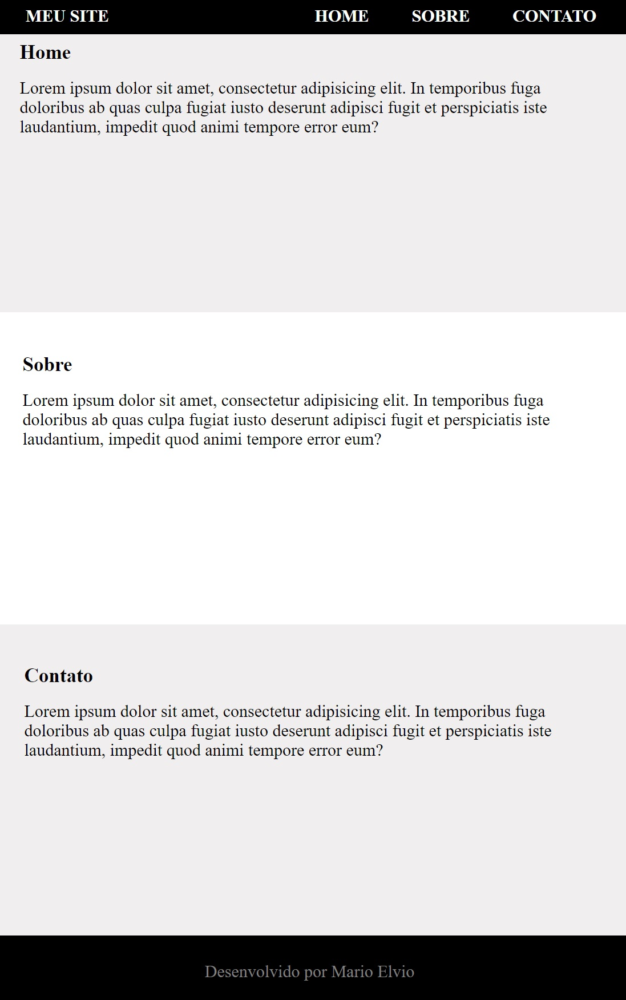

# UNIARA | PROGRAMAÇÃO WEB - TÓPICO 4

## 1)Um seletor de tipo e uma declaração

### Arquivo: assets/css/styles.css

### Linha: 11

## 2)Um seletor descendente e uma declaração

### Arquivo: assets/css/header.css

### Linha: 20

## 3)Um seletor de classe e uma declaração

### Arquivo: assets/css/header.css

### Linha: 13

## 4)Um seletor de id e uma declaração

### Arquivo: assets/css/home.css

### Linha: 1

## 5)Crie um Estilo Inline com um seletor e uma declaração

### Arquivo: index.html

### Linha: 52

## 6)Crie um Estilo Incorporado com um seletor e uma declaração

### Arquivo: index.html

### Linha: 10

## 7)Crie um Estilo Externo com um seletor e uma declaração

### Arquivo: assets/css/styles.css

### Linha: 1
