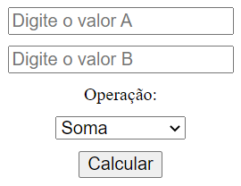

# UNIARA | PROGRAMAÇÃO WEB - TÓPICO 6

## Visualizar Projeto Online: <a href="https://marioelvio.com/portfolio/faculdade/6/" target="_blank">click aqui!</a>

## No HTML:

## 1) Crie 2 campos de texto (com labels) "Valor A” e "Valor B”.

## 2) Crie um combobox opção (com label opção) com os valores "Soma, Subtração, Divisão e Multiplicação”.

## 3) Crie (apenas) um botão "Calcular”.

## No JavaScript:

## 4) Crie uma função principal (será chamada pelo botão calcular).

## 5) Crie mais 4 funções (Soma, Subtração, Divisão e Multiplicação).

## 6) Na função principal, valide a opção que o usuário selecionou e escolha a respectiva função.

