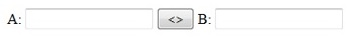
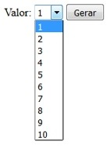

# UNIARA | PROGRAMAÇÃO WEB - TÓPICO 7

## 1) Crie o formulário abaixo:

### Projeto: exercicio1.html

### Visualizar Exercício Online: <a href="https://marioelvio.com/portfolio/faculdade/7/exercicio1.html" target="_blank">click aqui!</a>

## 2) Crie o formulário abaixo:

## Ao clicar no botão "gerar", apresentar na página a tabuada do número selecionado (número x 0 até número 10). Utilizar laço de repetição. Ao clicar no botão novamente, a tabuada anterior deve ser apagada!

### Projeto: exercicio2.html

### Visualizar Exercício Online: <a href="https://marioelvio.com/portfolio/faculdade/7/exercicio2.html" target="_blank">click aqui!</a>

## 3) Idem exercício 2, no entando, ao clicar no botão "gerar", as consultas anteriores devem ser mantidas!

### Projeto: exercicio3.html

### Visualizar Exercício Online: <a href="https://marioelvio.com/portfolio/faculdade/7/exercicio3.html" target="_blank">click aqui!</a>

