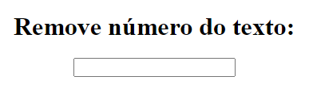

# UNIARA | PROGRAMAÇÃO WEB - TÓPICO 7

## 1) Faça um algoritmo que ao usuário digitar um valor em um campo de texto, o mesmo é validado. Caso seja um número, o mesmo deve ser removido do campo.

### Projeto: index.html

### Visualizar Exercício Online: <a href="https://marioelvio.com/portfolio/faculdade/8/index.html" target="_blank">click aqui!</a>

### Ao digitar no campo input ele chama uma função removeNum toda vez que uma tecla é despressionada. A função removeNum objetivo de receber o valor do input e varrer todas as suas posições removendo todos os números de 0 a 9, após remover ela substitue o valor do input sem os números.
